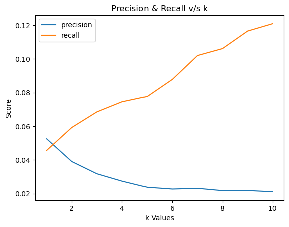

# Report - Team 8

## Reasoning for choosing Apriori
 - **Simplicity**: Apriori is generally simpler to understand and implement, making it a good choice for straightforward association rule mining tasks.
 - **Dataset characteristics**: If the dataset is relatively small or has a low number of transactions (users) compared to items (movies), Apriori can be efficient enough. 
 - **Interpretability**: Apriori generates rules that are often easier to interpret, which can be beneficial when analyzing user-movie relationships. 
 - **Memory usage**: For datasets with a large number of unique items but fewer transactions, Apriori might use less memory than FP-Growth, which builds a tree structure. 
 - **Rule generation**: If you're specifically interested in generating and analyzing association rules, Apriori directly produces these rules, while FP-Growth requires an additional step. 
 - **Sparsity**: If the dataset is sparse (many users rate only a few movies), Apriori can handle this efficiently. 
 - **Familiarity**: Apriori is more widely known and used, which can be advantageous for collaboration or when using existing implementations.

## Recommendation System

### Data Pre-procesing
1) Data Import: We used dataset from ratings.csv file

2) Filtering: Selected only rows which have rating greater than 2, considering only positively rating movies

3) User selection: We select users who have rated more than 10 movies, ensuring we have a sufficient amount of data for building the recommendation system.

4) Train-Test Split: We split data into training and testing sets with than 80-20 ratio by using the library  from sklearn.model_selection import train_test_split”

### Steps
**1. Data Preparation**
- The code assumes that we've already split data into training and test sets, with `train_set` and `test_set` dictionaries where keys are user IDs and values are lists of movie IDs.

**2. Support Function**
- A `support` function is defined to calculate how often a set of movies appears together in users' ratings.
- It counts how many users have rated all the given movies and divides by the total number of users.

**3. Generating Frequent Itemsets**
- The `generate_frequent_itemsets` function finds sets of movies that are often rated together.
- It starts with individual movies and progressively builds larger sets.
- It uses the Apriori principle: if a set of movies is frequent, all its subsets must also be frequent.

**4. Generating Association Rules**
- The `generate_association_rules` function creates rules like "If a user likes movie A, they might also like movie B".
- It calculates the confidence of each rule, which is how likely the rule is to be true.

**5. Setting Parameters**
- `minsup` (minimum support) is set to 0.09, meaning a set of movies must appear in at least 9% of users' ratings to be considered.
- `minconf` (minimum confidence) is set to 0.1, meaning a rule must be true at least 10% of the time to be included.

**6. Processing the Data**
- The code finds all unique movies in the training set.
- It calculates the support for each individual movie.

**7. Finding Frequent Itemsets**
- The code starts with individual movies and builds up to larger sets of movies that are often rated together.
- It continues this process until no larger frequent itemsets can be found.

**8. Generating Rules**
- Using the frequent itemsets, the code generates all possible association rules.
- It then filters these to keep only rules where the antecedent (the "if" part) is a single movie.

**9. Sorting and Displaying Results**
- The final rules are sorted by confidence (how likely they are to be true).
- The code prints out the number of rules found and then lists each rule with its support and confidence.

This process creates a simple recommendation system: if a user has rated a particular movie, the system can suggest other movies based on the association rules it has discovered.

### Procedure
 * We first choose and decide over a `k value` by iterating over a range from 1 to 10 as given

 * Further, for every k value, we iterate over every `user in the test set` and generate recommendations

 * In order to generate recommendations, we select only the `top k rules by confidence` from all the association rules generated for every movie in the training set of the user curretly being processed

 * We then take union of all the `Ys from X->Y` type rules. This union is basically the prediction / recommendation for that user

 * Once we have the recommendations, we simply calculate `recall & precision` for that user for that k value using the test set of that user

 * We do this process, as mentioned above, for each user in the test set and gather all the values of recall & precisions

 * And similarly, we do this for all the k values range also. For every k, we `average out reacall & precision` values of all the users

 * Finally, we plot this out for varying k against the averages

### Image

### Reasoning
__Decreasing Precision :__\
As the number of rules (k) increases, the average precision is likely to decrease. This occurs because a larger set of rules leads to more recommendations, some of which may not be relevant to the user. Consequently, precision, which measures the proportion of relevant items among the recommended ones, tends to decline as k increases.

__Increasing Recall :__\
Conversely, as the number of rules (k) increases, the average recall is likely to improve. This is because a larger set of rules results in more recommendations, increasing the likelihood of including relevant items from the test set. Recall measures the proportion of relevant items that are successfully recommended, and as the number of recommendations grows, so does the chance of covering a greater portion of the relevant items.

__Trade-off Between Precision & Recall :__\
The relationship between precision and recall typically exhibits a trade-off. When fewer rules are used (lower k), you tend to achieve higher precision but lower recall. Conversely, when more rules are applied (higher k), you generally obtain higher recall but lower precision. This trade-off is often visualized in a graph showing the inverse relationship between these two metrics as the number of rules changes.