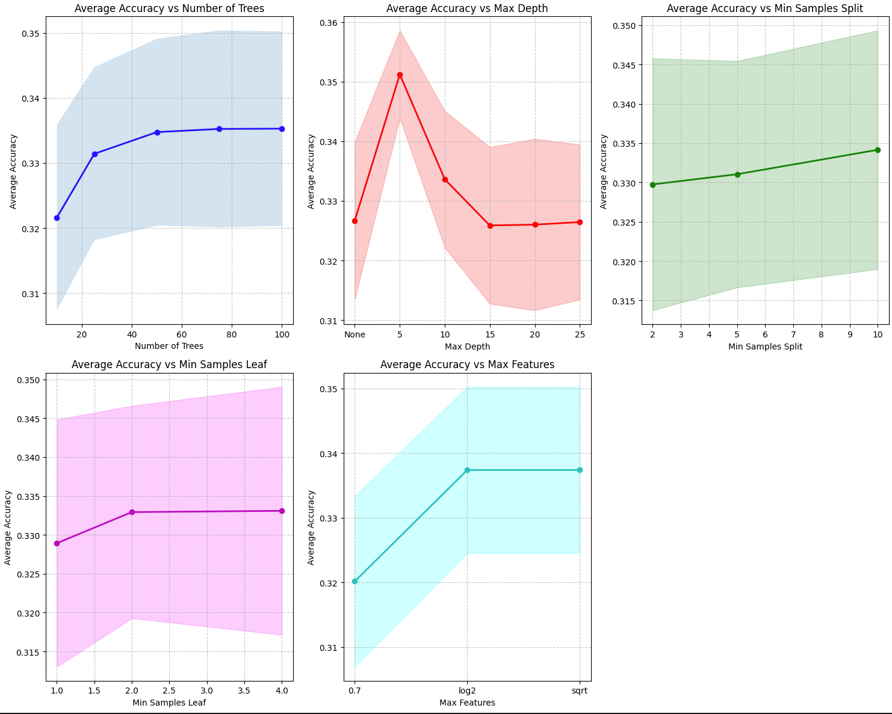
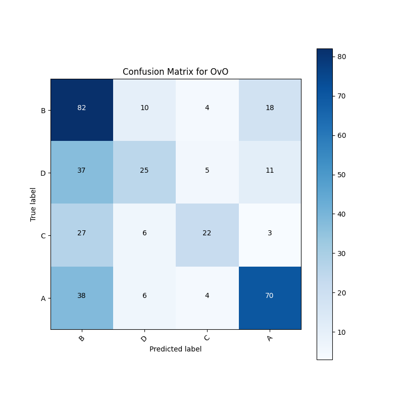
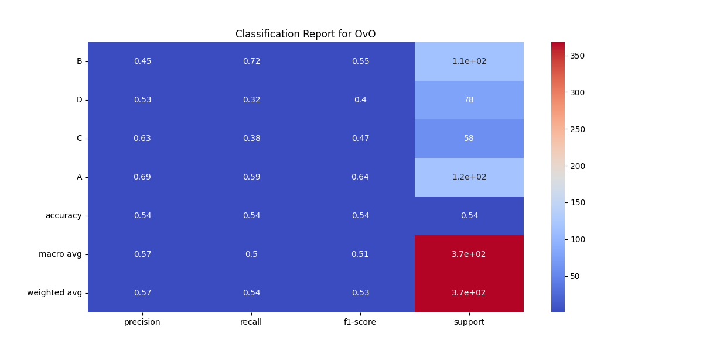
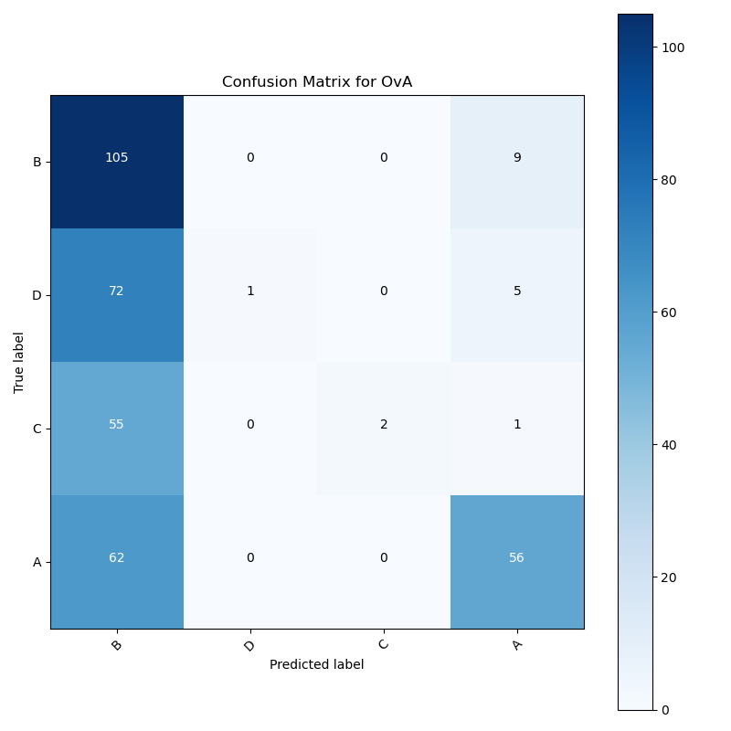
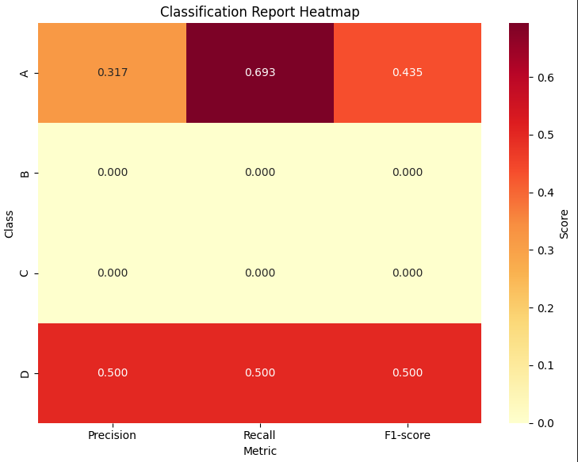
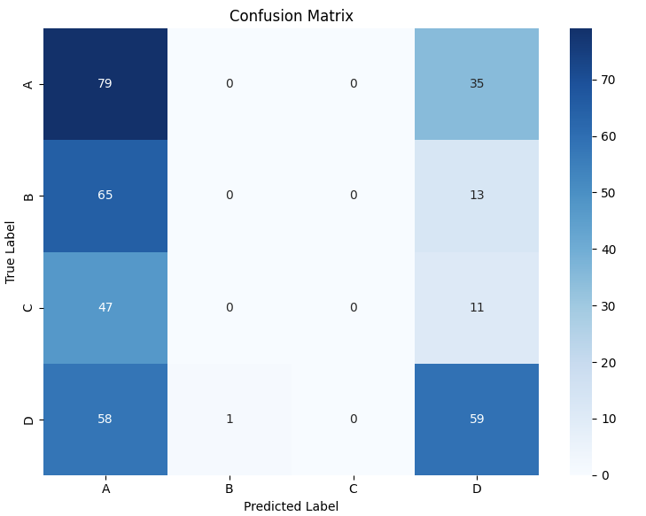

# Team 8 : Assingment 4 (Report)

## `Assumptions`

* For Task 1, when training the SVM classifiers, `kernel : rbf` is used because it was noticed that there were better results in case of __rbf__ as compared to __linear__

## `Task 1`

### Choosing Tuning Parameters

* We have manually run multiple runs on different combinations of `C & Gamma` with splitting of the training set

* We used `validation sets` to calculate accuracy for the purpose of tuning both the above parameters

* Some of the best balanced combinations we found are as below (C | Gamma | Accuracy):
    * > 10 | 0.1 | 0.3967391304347826
    * > 20 | 0.1 | 0.4076086956521739
    * > 10 | 0.2 | 0.44021739130434784
    * > 20 | 0.2 | 0.4483695652173913

* Currently, we have kept the combo of `C=10 & Gamma=0.2` as the most balanced one to avoid any kind of __underfit or overfit__

* Although, these values can be easily changed according to the purpose in the functions

## `Task 2`

### 1. Feature Selection
* Options: sqrt, log2, or percentage of features
* Different features for each split
* Decorrelates trees for better generalization

### 2. Decision Tree Parameters
* max_depth: Controls tree complexity
* min_samples_split/leaf: Prevents overfitting in leaf nodes
* Both control granularity of decision boundaries

### 3. Voting Mechanism
* Each tree makes a prediction
* Final prediction by majority voting
* More robust than single tree decisions

## Key Design Choices
* Used cross-validation for parameter tuning
* Implemented grid search over multiple parameters
* Created visualization for parameter impact analysis
* Included metrics for multi-class performance evaluation

## `Task 3`

### Part A

__Impact__
- Models bias toward majority classes
- Minority classes often misclassified
- Standard metrics become unreliable
- Small datasets amplify these issues

__Mitigation Strategies__

* Data-Level
    - SMOTE (careful with small datasets)
    - Undersampling majority classes
    - Hybrid approaches (SMOTEENN, SMOTETomek)

* Algorithm-Level
    - Adjust class weights
    - Use ensemble methods
        * Balanced Random Forest
        * Easy Ensemble
    - One-vs-Rest with balancing

* Evaluation
    - Use balanced metrics
        * Macro F1-score
        * Per-class precision/recall
    - Implement stratified cross-validation

__Small Dataset Considerations__
- Conservative resampling
- Careful synthetic data validation
- Stratified k-fold CV
- Ensure minimum class representation

### Part B

#### Random Forest Hyperparameters impact:

 

* Number of Trees:
  * Underfitting: Too few trees (see how accuracy is lower at 10-20 trees)
  * Overfitting: More trees generally don't cause overfitting (notice how the curve plateaus after 40 trees)
  * Best balance: Around 40-60 trees where the accuracy stabilizes

* Max Depth:
  * Underfitting: Too shallow trees (see low accuracy at depth=5)
  * Overfitting: Deeper trees (notice accuracy decreases after depth=5)
  * Best balance: Moderate depth or None (unlimited) based on the graph

* Min Samples Split/Leaf:
  * Underfitting: High values restrict tree growth too much
  * Overfitting: Very low values (1-2) allow trees to capture noise
  * Best balance: Moderate values show slight improvement in accuracy

* Max Features:
  * Underfitting: Too few features (0.7) limit model's learning capacity
  * Overfitting: Too many features might make trees too specialized
  * Best balance: 'sqrt' or 'log2' show better performance

#### SVM classifiers hyperparameters impact:

* Kernel Selection:
  * Underfitting: Using linear kernel when data has clear non-linear relationships
  * Overfitting: Using complex kernels (like RBF) with high gamma for simple relationships
  * Best balance: Begin with linear, switch to RBF if performance indicates non-linear patterns
  
* C Parameter (Regularization):
  * Underfitting: Very low C values (< 0.1) force the model to underfit by making margins too wide
  * Overfitting: Very high C values (> 100) let model create complex boundaries following noise
  * Best balance: Moderate C values (1-10) provide good trade-off between margin width and error tolerance

* Gamma Parameter (RBF Kernel):
  * Underfitting: Very low gamma values (< 0.001) make model consider too many distant points
  * Overfitting: High gamma values (> 1) make model focus too much on individual training points
  * Best balance: Moderate gamma values (0.1-1) or using 'scale' option for automatic selection

### Part C

__OvO Plots__

 

__OvA Plots__

 

__Random Forest Plots__

 
 

### Part D

1. __Overall Accuracy__
    - OvA: 45% accuracy
    - OvO: 54% accuracy
    - **Result**: OvO performs better with 9% improvement

2. __Class-wise Performance__

    * Class A
        - OvA: Precision=0.79, Recall=0.47, F1=0.59
        - OvO: Precision=0.69, Recall=0.59, F1=0.64
        - **Result**: OvO achieves better balanced performance
    
    * Class B
        - OvA: Precision=0.36, Recall=0.92, F1=0.51
        - OvO: Precision=0.45, Recall=0.72, F1=0.55
        - **Result**: OvO shows better balanced metrics

    * Class C
        - OvA: Precision=1.0, Recall=0.034, F1=0.067
        - OvO: Precision=0.63, Recall=0.38, F1=0.47
        - **Result**: OvO shows more balanced metrics
        - 
    * Class D
        - OvA: Precision=1.0, Recall=0.013, F1=0.025
        - OvO: Precision=0.53, Recall=0.32, F1=0.40
        - **Result**: OvO demonstrates significantly better balanced performance

3. __Confusion Matrix Analysis__
    - OvA exhibits strong bias toward class B predictions
    - OvO shows better distribution of predictions across classes
    - OvO has fewer extreme misclassifications

4. __Overall Verdict__\
The OvO model performs better for this dataset due to:
    - Higher overall accuracy
    - More balanced precision-recall trade-offs
    - Better handling of class imbalance
    - More evenly distributed predictions
    - Higher F1-scores across all classes